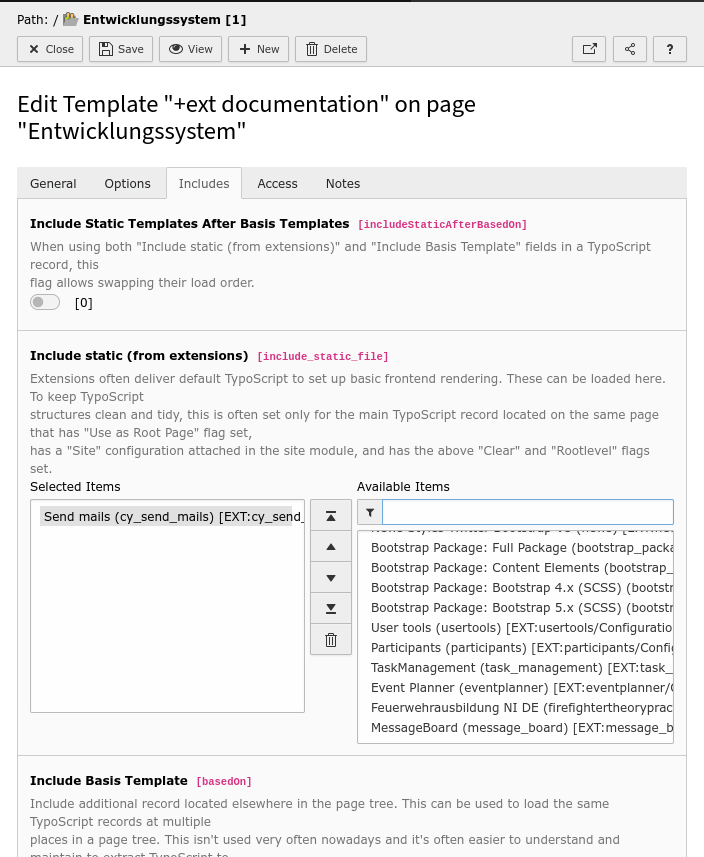
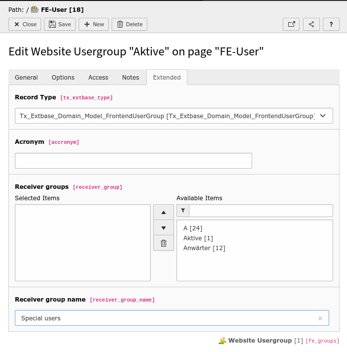
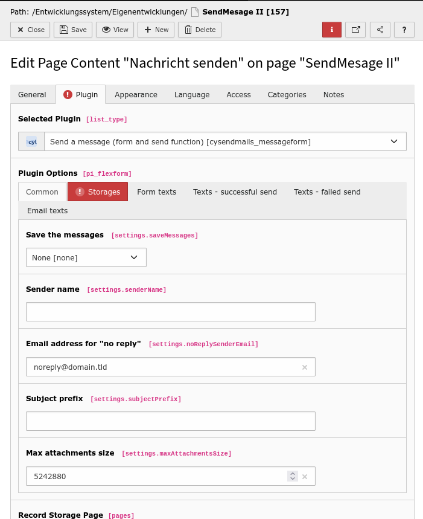
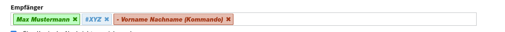

# Typo3 Extension :: cySendMails
This extension allows frontend users to write emails to other frontend users without them knowing their email address. 
This extension is specifically for a manageable group of people. For example a club. The members can easily send emails to each other. Currently, the extension is practically used for up to 60 people and works without problems. 

## Limitations
* They also pay attention mail limitations their web hosters. 

## Installation

You can install the extension via the extensions module or via composer.json. 

 

In the second step you have to add the plugin to the TypoScript. To do this, you need to add the TypoScript of the plugin via the static template. 

## Configuration

### Frontend user groups

* With the assignment "Receiver groups" you can set which other groups you can write to if you belong to this FrontendUser group. 

* Only FrontendUser groups with a recipient name can be written to. So the recipient names do not have to match the group name. 

 

## Add the plugin to your website

Then you can add the plugin to your website. 

Thereby you have to consider the following: 

 

* Carefully choose the folders where the frontend users will be stored. All these frontend users can see each other in this tool. 
* Also, a folder must be specified where the sent messages will be stored, if any. I would place this folder where only selected people have access (basic data protection regulation). 
* Because different data sources are interesting, the "Record Storage Page" is not used
* It is recommended that the "no reply" email is a dead email address of your own domain. This has the advantage that if someone replies to a mail from the website in his e-mail program, where no sender e-mail address was sent, he will immediately receive a response from his e-mail provider.

## Using

 

It is possible to select single persons (green). All groups start with a hashtag (yellow) and you can also exclude single persons (starts with a minus sign and is red - this is good for birthday preparations for example).

